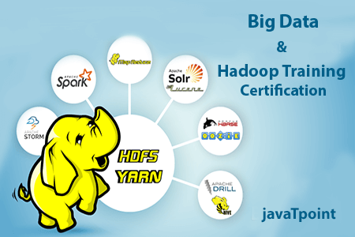

# Software-tools
**Overview of Hadoop:**
1. *Open-Source*: Hadoop is free to use, and anyone can modify or improve it.
2. *Storing Large Datasets*: Hadoop allows companies to store vast amounts of data
across multiple computers, so they aren't limited by the storage capacity of a single
machine. It uses a special file system called HDFS (Hadoop Distributed File System)
to manage this.
3. *Processing Big Data*: Hadoop process data efficiently. Instead of using one computer
to do all the work, Hadoop splits the work across many computers, making it much
faster. It uses a technique called MapReduce to break down complex tasks into smaller
ones and then combine the results.

